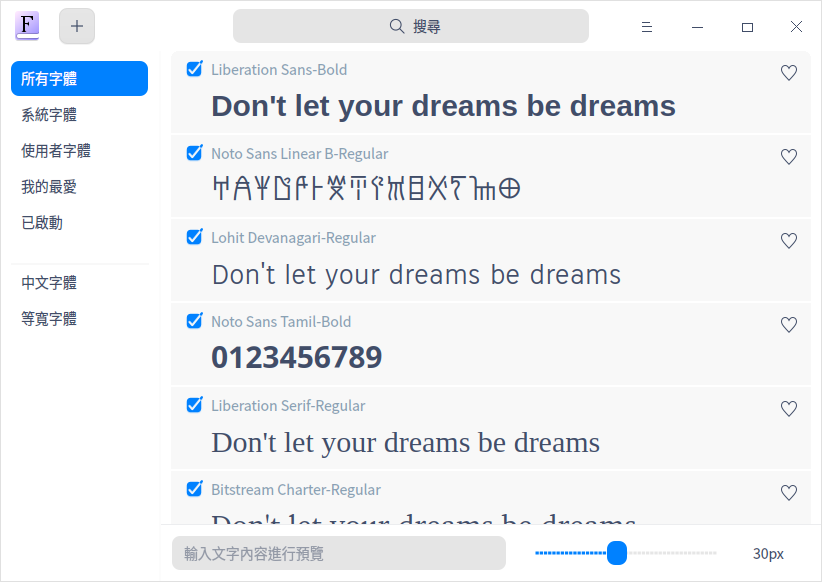
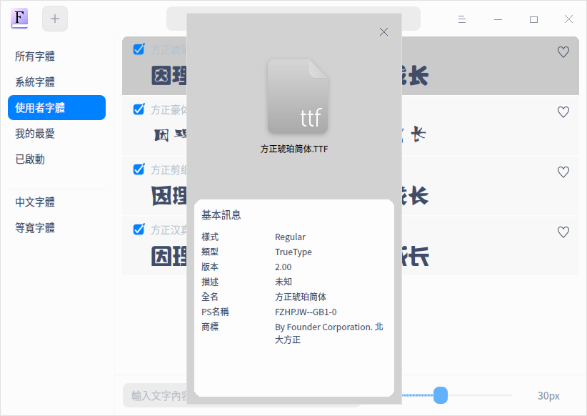
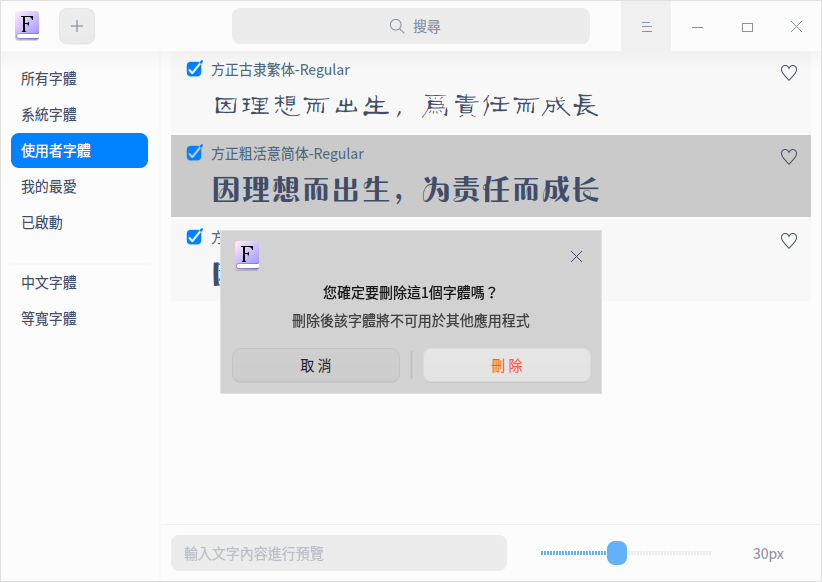

# 字體管理器|deepin-font-manager|

## 概述

字體管理器是一款功能強大的字體管理工具，幫助使用者將下載的字體進行安裝，並且具有尋找、啟用、禁用、收藏、刪除字體等功能，還可以透過輸入文字內容、設定文字大小進行字體預覽。

字體管理器支援安裝的字體格式有ttf、ttc、otf。

## 使用入門

您可以透過以下方式執行或關閉字體管理器，或者建立字體管理器的捷徑。

### 執行字體管理器

1. 單擊任務欄上的啟動器圖示 ，進入啟動器介面。
2. 上下滾動滑鼠滾輪瀏覽或透過搜尋，找到字體管理器 單擊執行。
3. 右鍵單擊 ，您可以：

   - 單擊 **建立桌面捷徑**，在桌面建立捷徑。
   - 單擊 **釘選到Dock**，將應用程式固定到Dock。
   - 單擊 **開機啟動**，將應用程式添加到開機啟動項，在電腦開機時自動執行該應用。

### 關閉字體管理器

- 在字體管理器介面單擊  ，關閉字體管理器。
- 在任務欄右鍵單擊 ，選擇 **全部關閉** 來關閉字體管理器。
- 在字體管理器介面單擊 ，選擇 **退出** 關閉字體管理器。

### 查看快捷鍵

使用快捷鍵 **Ctrl + Shift + ?** 打開快捷鍵預覽介面。熟練地使用快捷鍵，將大大提升您的操作效率。

## 操作介紹

### 介面介紹

| 名稱     | 說明                                                       |
| -------- | ---------------------------------------------------------- |
| 所有字體 | 系統字體和使用者字體的集合，預設顯示所有字體。               |
| 系統字體 | 系統自帶的字體列表，不能被刪除和禁用。     |
| 使用者字體 | 使用者安裝的字體列表。                                      |
| 我的最爱 | 使用者收藏的字體列表。 |
| 已啟動   | 啟動狀態的所有字體合集。                                   |
| 中文字體 | 所有字體中的中文字體。                     |
| 等寬字體 | 所有字體中字元寬度相同的字體。                             |

### 安裝字體

字體管理器可以安裝單個字體，也可以批次安裝多個字體，您可以透過以下方式進行安裝。

- 在字體管理器介面，單擊選單欄上的圖示  或  > **添加字體**，或右鍵單擊字體選擇 **添加字體**，選擇需要安裝的字體檔案。
- 右鍵單擊字體檔案並選擇 **用其他程式開啟** > **字體管理器**，進入字體管理器介面，安裝字體。
- 雙擊字體檔案，安裝字體。
- 將字體檔案拖曳到字體管理器介面或圖示上。

> 說明: 
>
> - 字體管理器會自動檢測您的字體，如果本機已經安裝過該字體，會顯示已安裝相同版本的提示訊息，此時可以選擇  **離開**  或 **繼續** 安裝操作。
> - 您可以打開 **控制中心** > **個性化** > **字型** 設定 **標準字型**。

### 預覽字體

字體集中字體的每個文字塊呈現著字體的樣式，可以透過預覽字體，體驗字體的顯示效果。

預設預覽文案中文為「因理想而出生，為責任而成長」。

1. 在底部字體預覽輸入框中輸入文字內容。
2. 透過左右拖動滑塊設定字體大小，在字體集列表中查看字體顯示效果。

   > 說明：向左滑動為縮小字體，向右滑動為放大字體，字體大小範圍為6px - 60px。

### 搜尋字體

1. 在字體管理搜尋框中，單擊。
2. 輸入關鍵字，即時展示搜尋結果。
3. 在搜尋框中單擊，或刪除搜尋框中輸入的訊息，即可清除目前輸入的搜尋條件或取消搜尋。

### 匯出字體

1. 在使用者字體列表中，右鍵單擊字體。
2. 選擇 **匯出字體**，匯出該使用者字體。

匯出字體預設儲存路徑：桌面資料夾，資料夾預設名稱：字體

> 說明：既支援匯出單個字體，也支援批次匯出字體，系統字體不能被匯出。

### 收藏/取消收藏字體

當您需要收藏或者取消收藏字體時，可以使用字體管理器執行該操作。

1. 選擇一個未被收藏的字體並單擊其右側  圖示，或右鍵單擊該字體，選擇 **收藏**。

2. 選擇一個已被收藏的字體並單擊其右側  圖示，或右鍵單擊該字體，選擇 **取消收藏**。

   被收藏的字體會在「我的最爱」列表中顯示。

> 說明：既支援收藏/取消收藏單個字體，也支援批次收藏/取消收藏字體。

### 啟用/禁用字體 

您可以在字體管理器中啟用或禁用「使用者字體」。使用者字體預設為已啟用狀態。

1. 在**使用者字體** 列表，取消已勾選的字體狀態，或右鍵單擊該字體，選擇 **禁用字體** 禁用該字體。

2. 勾選被禁用的字體，或右鍵單擊該字體，選擇 **啟用字體** 啟用該字體。

      已啟用的字體會在「已啟動」列表中顯示。

> 說明：既支援啟用/禁用單個字體，也支援批次啟用/禁用字體。系統字體和系統正在使用的使用者字體不可被禁用。

### 查看字體基本訊息

您可以透過字體管理器查看字體基本訊息。

1. 在字體管理器介面，右鍵單擊字體。
2. 選擇 **訊息**，查看該字體的具體訊息。

### 查看字體安裝位置

當字體安裝成功後，您可以透過字體管理器查看字體安裝位置。

1. 在字體管理器介面，右鍵單擊字體。
2. 選擇 **在檔案管理器中顯示**，查看字體具體安裝位置。

### 刪除字體

當您需要刪除字體時，可以使用字體管理器執行該操作。

> 說明：既支援刪除單個字體，也支援批次刪除字體。系統字體和系統正在使用的使用者字體不能被刪除。

1. 在**使用者字體** 列表，右鍵單擊字體選擇 **刪除字體**。
2. 在彈出的提示對話框中單擊 **删除** 。

## 主選單

在主選單中，您可以切換視窗主題、查看說明手冊，了解字體管理器的更多訊息。

### 主題

視窗主題包含亮色主題、暗色主題和系統主題。

1. 在字體管理器介面，單擊 。
2. 單擊 **主題**，選擇一個主題顏色。

### 說明

查看說明手冊，進一步了解和使用字體管理器。

1. 在字體管理器介面，單擊 。
2. 單擊 **說明**。
3. 查看字體管理器的說明手冊。

### 關於

1. 在字體管理器介面，單擊 。
2. 單擊 **關於**。
3. 查看字體管理器的版本和介紹。

### 退出

1. 在字體管理器介面，單擊 。
2. 單擊 **退出**。